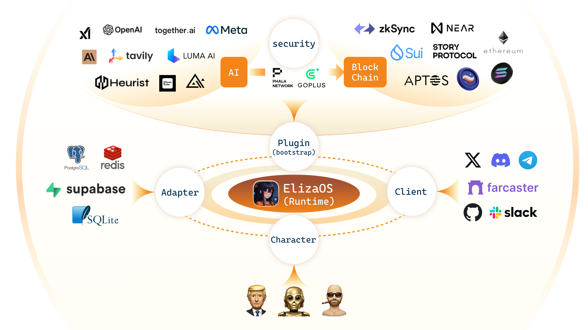

# Bork: Eliza's Chicken 🤖

<div align="center">
  
</div>

<div align="center">

📖 [Documentation](https://drive.google.com/file/d/1aMZsn1bP3dqiN3QVyi_7v61iLQ8DYPqy/view?usp=sharing/) | 🎯 [Examples](https://github.com/melondotdev/sui-ai-hackathon)

</div>

## 🚩 Overview

<div align="center">
  
</div>

## ✨ Features

- 🛠️ Full-featured Discord, Twitter and Telegram connectors
- 🔗 Support for every model (Llama, Grok, OpenAI, Anthropic, etc.)
- 👥 Multi-agent and room support
- 📚 Easily ingest and interact with your documents
- 💾 Retrievable memory and document store
- 🚀 Highly extensible - create your own actions and clients
- ☁️ Supports many models (local Llama, OpenAI, Anthropic, Groq, etc.)
- 📦 Just works!

## 🎯 Use Cases

- 🤖 Chatbots
- 🕵️ Autonomous Agents
- 📈 Business Process Handling
- 🎮 Video Game NPCs
- 🧠 Trading

## 🚀 Quick Start

### Prerequisites

- [Python 2.7+](https://www.python.org/downloads/)
- [Node.js 23+](https://docs.npmjs.com/downloading-and-installing-node-js-and-npm)
- [pnpm](https://pnpm.io/installation)

Once the agent is running, run "pnpm start:bork-client".
Open another terminal and move to same directory and then run below command and follow the URL to chat to your agent.

```bash
pnpm start:bork-client
```

Then read the [Documentation](https://elizaos.github.io/eliza/) to learn how to customize your Eliza.

### Manually Start Eliza (Only recommended if you know what you are doing)

```bash
# Clone the repository
git clone https://github.com/melondotdev/sui-ai-hackathon

### Edit the .env file

Copy .env.example to .env and fill in the appropriate values.

```
cp .env.example .env
```

Note: .env is optional. If you're planning to run multiple distinct agents, you can pass secrets through the character JSON

### Automatically Start Eliza

This will run everything to set up the project and start the bot with the default character.

```bash
sh scripts/start.sh
```

### Edit the character file

1. Open `packages/core/src/defaultCharacter.ts` to modify the default character. Uncomment and edit.

2. To load custom characters:
    - Use `pnpm start --characters="path/to/your/character.json"`
    - Multiple character files can be loaded simultaneously
3. Connect with X (Twitter)
    - change `"clients": []` to `"clients": ["twitter"]` in the character file to connect with X

### Manually Start Eliza

```bash
pnpm i
pnpm build
pnpm start

# The project iterates fast, sometimes you need to clean the project if you are coming back to the project
pnpm clean
```

### Community & contact

- [GitHub Issues](https://github.com/elizaos/eliza/issues). Best for: bugs you encounter using Eliza, and feature proposals.
- [Discord](https://discord.gg/ai16z). Best for: sharing your applications and hanging out with the community.

## Contributors

<a href="https://github.com/elizaos/eliza/graphs/contributors">
  
</a>

## Star History

[](https://star-history.com/#elizaos/eliza&Date)
